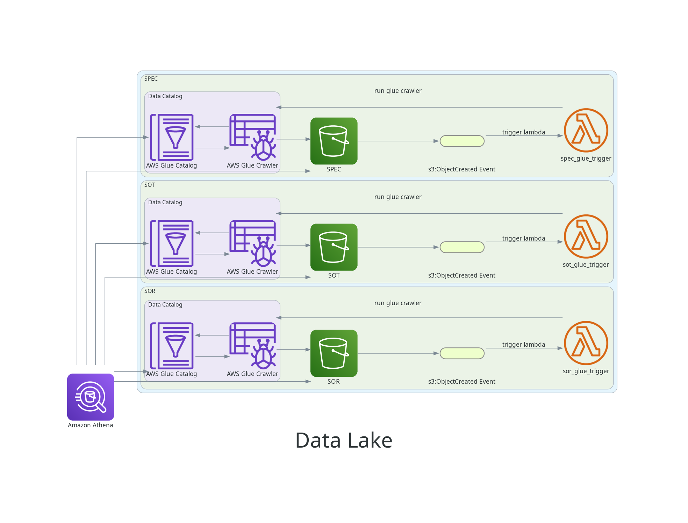

# Terraform AWS S3 Data Lake

This is a sandbox AWS S3 Data Lake provisioning terraform repository. The script will create three buckets:

- SOR (System of Records)
- SOT (Source of Truth)
- SPEC (Specialized)



## Usage

- **Terraform Plan**:

  Show what will be created.

  ```sh
  terraform plan
  ```

- **Terraform Apply**:

  Create the resources in _AWS_.

  ```sh
  terraform apply
  ```

- **Terraform Apply DEV**:

  Overrides `terraform.tfvars`

  ```sh
  terraform apply -var-file environments/dev/dev.tfvars
  ```

- **Show outputs**:

  ```sh
  terraform output
  ```

## Important!

Files must be uploaded in its own folder so Glue Crawler do the catalog correctly and avoid returning zero records at Athena queries.

## Resources

- [architecture-options](https://dev.to/aws-builders/architecture-options-for-building-a-basic-data-lake-on-aws-part-1-18hc)
- [aws-glue-s3-athena-and-terraform](https://medium.com/@todd_6710/infrastructure-as-code-built-data-lake-with-aws-glue-s3-athena-and-terraform-78bb54339f1a)
- [terraform-s3-backend-best-practices](https://medium.com/@jbornhoft/terraform-s3-backend-best-practices-revised-6f6a8fe8fdf7)
- [terraform-modules](https://github.com/WillBrock/terraform-course-examples)
- [sacalable-data-analytics](https://medium.com/@yaroslavzhbankov/architecting-scalable-data-analytics-harnessing-aws-athena-glue-s3-lambda-and-api-gateway-5e991d46c273)
- [data-analytics-with-aws-athena](https://dev.to/davidshaek/streamline-your-data-analytics-with-aws-athena-queries-and-terraform-5057)
- [tableau-sample-data](https://public.tableau.com/app/learn/sample-data)
- [kaggle-datasets](https://www.kaggle.com/datasets)
- [s3-trigger-lambda-terraform](https://hands-on.cloud/s3-trigger-lambda-terraform-example/)
- [event-based-trigger-of-aws-glue-crawler-after-a-file-is-uploaded-into-a-s3](https://stackoverflow.com/questions/48828194/event-based-trigger-of-aws-glue-crawler-after-a-file-is-uploaded-into-a-s3-bucke)
- [Youtube - Terraform Playlist](https://www.youtube.com/playlist?list=PL8HowI-L-3_9bkocmR3JahQ4Y-Pbqs2Nt)
- [dynamic-terraform-backend](https://dev.to/aws-builders/mastering-terraform-how-to-manage-multiple-environments-with-dynamic-s3-backends-1p9)
- [best-practices-for-terraform](https://cloud.google.com/docs/terraform/best-practices-for-terraform?hl=pt-br)
