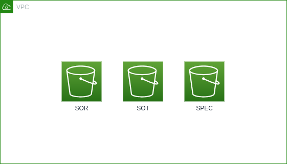

# Terraform AWS S3 Data Lake

This is a sandbox AWS S3 Data Lake provisioning terraform repository. The script will create three buckets:

- SOR (System of Records)
- SOT (Source of Truth)
- SPEC (Specialized)



## Usage

- **Terraform Plan**:

  Show what will be created.

  ```sh
  terraform plan
  ```

- **Terraform Apply**:

  Create the resources in _AWS_.

  ```sh
  terraform apply
  ```
