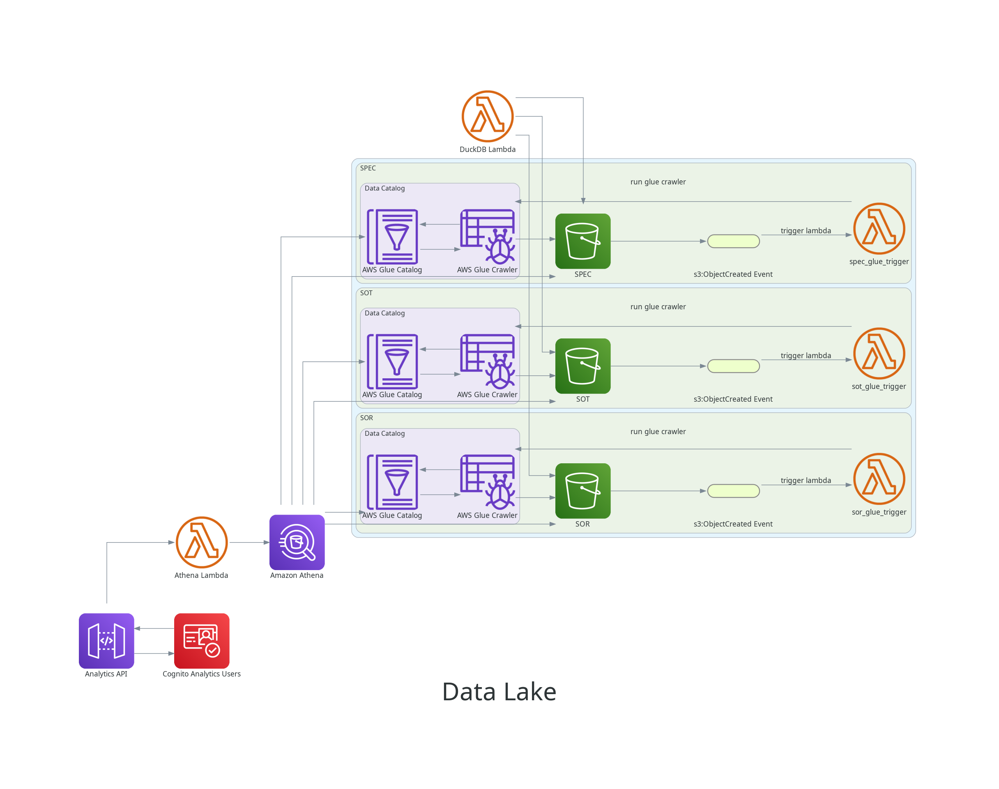

# Terraform AWS S3 Data Lake

This is a sandbox AWS S3 Data Lake provisioning terraform repository. The script will create three buckets:

- SOR (System of Records)
- SOT (Source of Truth)
- SPEC (Specialized)



## Usage

- **Terraform Plan**:

  Show what will be created.

  ```sh
  terraform plan
  ```

- **Terraform Apply**:

  Create the resources in _AWS_.

  ```sh
  terraform apply
  ```

- **Terraform Apply DEV**:

  Overrides `terraform.tfvars`

  ```sh
  terraform apply -var-file environments/dev/dev.tfvars
  ```

- **Show outputs**:

  ```sh
  terraform output
  ```

## Cognito

- **Get client ids by user pool id**:

```sh
aws cognito-idp list-user-pool-clients --user-pool-id ${COGNITO_USER_POOL_ID}
```

- **Sign Up**:

```sh
aws cognito-idp sign-up \
 --client-id ${COGNITO_USER_POOL_CLIENT_ID} \
 --username ${USER_USERNAME} \
 --password ${USER_PASSWORD} \
 --user-attributes Name=name,Value=${USER_NAME} Name=email,Value=${USER_EMAIL}
```

- **Admin confirm user Sign Up**:

```sh
aws cognito-idp admin-confirm-sign-up \
 --user-pool-id  ${COGNITO_USER_POOL_ID} \
 --username ${USER_USERNAME}
```

- **Check if user is confirmed**:

```sh
aws cognito-idp admin-get-user \
 --user-pool-id  ${COGNITO_USER_POOL_ID} \
 --username ${USER_USERNAME}
```

- **Get Token**:

```sh
aws cognito-idp initiate-auth \
 --client-id ${COGNITO_USER_POOL_CLIENT_ID} \
 --auth-flow USER_PASSWORD_AUTH \
 --auth-parameters USERNAME=${USER_USERNAME},PASSWORD=${USER_PASSWORD} \
 --query 'AuthenticationResult.IdToken'
```

- **Get Token**:

```sh
curl -H "Authorization: ${TOKEN}" https://${MY_API_GATEWAY_ENDPOINT}
```

## Important!

Files must be uploaded in its own folder so Glue Crawler do the catalog correctly and avoid returning zero records at Athena queries.

## Resources

- [architecture-options](https://dev.to/aws-builders/architecture-options-for-building-a-basic-data-lake-on-aws-part-1-18hc)
- [aws-glue-s3-athena-and-terraform](https://medium.com/@todd_6710/infrastructure-as-code-built-data-lake-with-aws-glue-s3-athena-and-terraform-78bb54339f1a)
- [terraform-s3-backend-best-practices](https://medium.com/@jbornhoft/terraform-s3-backend-best-practices-revised-6f6a8fe8fdf7)
- [terraform-modules](https://github.com/WillBrock/terraform-course-examples)
- [sacalable-data-analytics](https://medium.com/@yaroslavzhbankov/architecting-scalable-data-analytics-harnessing-aws-athena-glue-s3-lambda-and-api-gateway-5e991d46c273)
- [data-analytics-with-aws-athena](https://dev.to/davidshaek/streamline-your-data-analytics-with-aws-athena-queries-and-terraform-5057)
- [tableau-sample-data](https://public.tableau.com/app/learn/sample-data)
- [kaggle-datasets](https://www.kaggle.com/datasets)
- [s3-trigger-lambda-terraform](https://hands-on.cloud/s3-trigger-lambda-terraform-example/)
- [event-based-trigger-of-aws-glue-crawler-after-a-file-is-uploaded-into-a-s3](https://stackoverflow.com/questions/48828194/event-based-trigger-of-aws-glue-crawler-after-a-file-is-uploaded-into-a-s3-bucke)
- [Youtube - Terraform Playlist](https://www.youtube.com/playlist?list=PL8HowI-L-3_9bkocmR3JahQ4Y-Pbqs2Nt)
- [dynamic-terraform-backend](https://dev.to/aws-builders/mastering-terraform-how-to-manage-multiple-environments-with-dynamic-s3-backends-1p9)
- [best-practices-for-terraform](https://cloud.google.com/docs/terraform/best-practices-for-terraform?hl=pt-br)
- [glue-terraform](https://www.youtube.com/watch?v=CYZ3ZjXdQP8)
- [deploying-containerized-aws-lambda-functions-with-terraform](https://medium.com/akava/deploying-containerized-aws-lambda-functions-with-terraform-7147b9815599)
- [terraform-docker-and-aws-lambda](https://ragunathrajasekaran.medium.com/building-scalable-serverless-applications-with-terraform-docker-and-aws-lambda-part-1-2-e9ff688f2794)
- [aws-glue-job-input-parameters](https://stackoverflow.com/questions/52316668/aws-glue-job-input-parameters)
- [problem-in-getting-result-from-aws-ecr-get-login](https://stackoverflow.com/questions/54232443/problem-in-getting-result-from-aws-ecr-get-login)
- [athena-output-bucket-error](https://repost.aws/knowledge-center/athena-output-bucket-error)
- [restricting-user-access-to-pages-using-aws-cognito](https://levelup.gitconnected.com/building-a-multi-page-app-with-streamlit-and-restricting-user-access-to-pages-using-aws-cognito-89a1fb5364a3)
- [terraform-aws-api-gateway-v2](https://github.com/comtravo/terraform-aws-api-gateway-v2)
- [serverless-openapi-amazon-api-gateway](https://blog.serverlessadvocate.com/serverless-openapi-amazon-api-gateway-with-the-aws-cdk-part-1-8a90477ebc24)
- [api-gateway-to-a-lambda-function-using-lambda-proxy-and-non-proxyintegration-with-openapi-specs](https://dev.to/aws-builders/api-gateway-to-a-lambda-function-using-lambda-proxy-and-non-proxyintegration-with-openapi-specs-5eak)
- [create-an-internal-amazon-api-gateway-with-terraform](https://medium.com/@sophie.cosgrove/create-an-internal-amazon-api-gateway-with-terraform-6a7d319fc0fd)
- [openapi-defined-aws-api-gateway-with-cognito-in-terraform](https://medium.com/@xpiotrkleban/openapi-defined-aws-api-gateway-with-cognito-in-terraform-38f28ce459b3)
